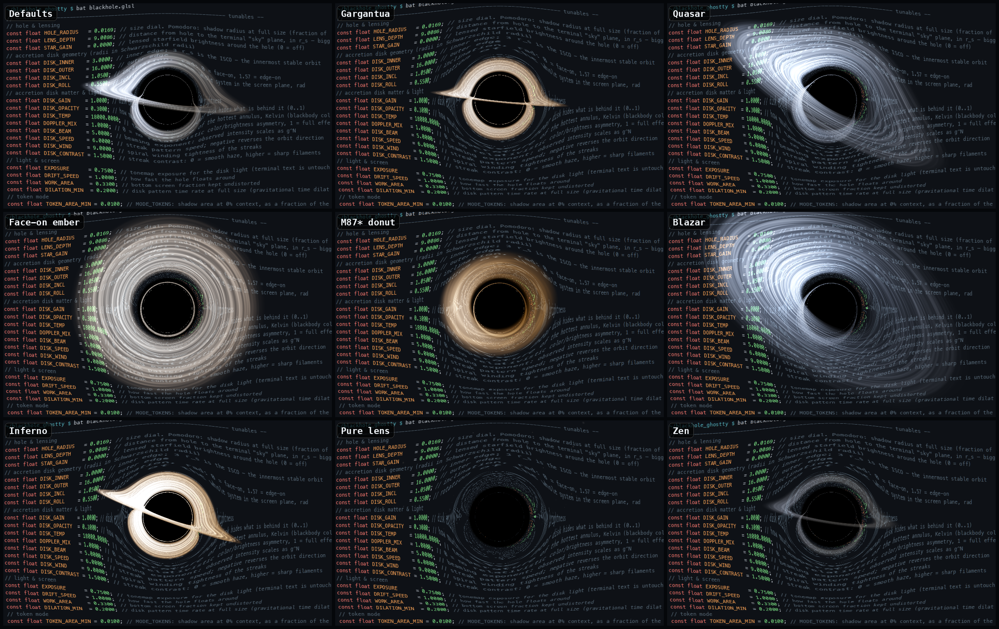

# Ghostty Blackhole


**Landing page:** [s13k.dev/blackhole](https://s13k.dev/blackhole/)

A black hole floating inside your [Ghostty](https://ghostty.org) terminal. It
starts small and grows to swallow your screen, driven by whichever **size mode**
you pick: a built-in *pomodoro* clock (grow through the hour, demand a break,
leave you alone once you take it), or *token mode*, where it tracks how full
**Claude Code's context window** is in real time.

Modeled on [Eric Bruneton's black hole shader](https://ebruneton.github.io/black_hole_shader/),
which beam-traces Schwarzschild geodesics against precomputed lookup tables.
A Ghostty custom shader is a single Shadertoy-style fragment pass with no
custom textures, so the lookup tables are replaced by doing the physics live:
every pixel near the hole **integrates its own null geodesic** through the
Schwarzschild metric (the Binet-form acceleration `a = -3/2 h² x/r⁵`, which
gives the exact photon bending). Your terminal contents play the role of the
lensed background sky. Nothing below is painted on — it all falls out of the
ray tracing:

## What it renders

- **The shadow** — rays with impact parameter under `b_crit = (3√3/2) r_s`
  spiral through the horizon and come back black. Text near the edge is
  stretched into the photon ring before it disappears; text behind the hole
  really is gone.
- **Gravitational lensing** — escaped rays are projected back onto the
  terminal "sky" plane: text bends, magnifies, and shows the mirrored
  secondary image inside the Einstein ring. Far from the hole this hands off
  to the analytic weak-field deflection (`α = 2r_s/b`), so only pixels near
  the hole pay for the integration. Blue bends slightly more than red out
  there for a touch of chromatic aberration.
- **Accretion disk** — a thin Keplerian disk that a ray can pierce several
  times: the far side arcs *over and under* the shadow (the Interstellar
  look), and the photon-ring region shows higher-order disk images.
  Coloring is physical: a Shakura–Sunyaev temperature profile rendered as
  blackbody color, shifted and beamed by the relativistic factor
  `g = √(1 − 1.5 r_s/r)/(1 − β·k̂)` — the approaching side is blue-hot and
  boosted by `g^N`, the receding side dim and red.
- **Photon ring** — rays winding near the `1.5 r_s` photon sphere pick up
  every disk crossing; the bright thin ring is emergent, not drawn.
- **Lensed starfield** — a faint procedural sky sampled with the *bent* ray
  direction, so stars smear into arcs around the hole (off by default —
  raise `STAR_GAIN` to enable).
- **Gravitational time dilation** — the disk pattern at radius `r` advances
  at the proper rate `√(1 − 1.5 r_s/r)`, so the inner orbits visibly freeze;
  the whole disk also winds down as the hole grows heavier (`DILATION_MIN`).
- The hole drifts on a slow Lissajous path, confined to the upper part of
  the screen — the bottom `WORK_AREA` fraction (your prompt) is never
  distorted. Drift speed and reach follow its size: small and calm, big
  and restless.

## Pomodoro mode

The break reminder is computed entirely inside the shader — no daemon, no
shell hooks, nothing outside `blackhole.glsl`.

Shaders are stateless (no buffers persist between frames, and Ghostty has no
custom uniforms), so a shader cannot remember when *your* work streak began.
Instead the schedule is anchored to the wall clock via `iDate`:

- **Cycle**: the hole is always present while you work — it starts small at
  the cycle floor, grows over `WORK_PERIOD_MIN` (default 55 min), collapses
  back to small in the last minute, and stays small through `BREAK_MIN`
  (default 5 min). With 55+5 the peak hits at five-to-the-hour — a fixed,
  predictable rhythm.
- **Typing detector**: `iTimeCursorChange` tracks cursor activity in your
  terminal. Stop using it for `IDLE_FADE_SEC` (default 90 s) and the hole
  shrinks live, gone entirely after a few minutes of quiet — it never nags
  while you aren't actually working.

The trade-off of self-containment: the cycle won't re-anchor to a break you
take at an odd time — it's an hourly bell, not a per-streak stopwatch.

> **Caveat:** stock Ghostty (through 1.3) declares `iDate` but never
> populates it — it is always zero — so on current releases the wall-clock
> schedule doesn't advance: the hole sits at its small cycle-floor size and
> only the typing detector works. The full cycle comes alive once Ghostty
> wires `iDate` up (you can preview it today with `TIME_SCALE`, which runs
> off `iTime` instead). Token mode, the default, is unaffected.

## Size modes

What drives the hole is selected by `SIZE_MODE` near the top of `blackhole.glsl`:

- `MODE_POMODORO` — the self-contained wall-clock schedule described above. Works
  standalone, no setup beyond the shader (but see the `iDate` caveat above).
- `MODE_TOKENS` *(default)* — the hole tracks **Claude Code's context-window
  fill**. Requires the bundled command (below).
- `MODE_DEMO` — a self-running **42-second showcase loop** for recording demos:
  the hole grows from the corner seed to 100 % exactly as token mode would,
  while the disk look tours the tuner presets (Inferno → Gargantua → M87* donut
  → Face-on ember → Quasar → Blazar → Pure lens → Inferno), crossfading at each
  ~5 s slot boundary. Everything runs off `iTime` inside one compiled shader —
  no reloads, so a recording never hitches. Toggle it with `./demo-mode.sh
  on|off` (which also reloads Ghostty); the cursor channel is ignored in demo
  mode, so a live Claude session can't disturb a recording. Record any full
  cycle — the loop restart is obvious (the hole snaps back to the corner
  seed).

### Token mode

The hole reflects how full Claude's context window is, *live*:

- **Empty context** — a small hole in the **top-right corner**, sized to
  cover `TOKEN_AREA_MIN` (default **0.06 %**) of the terminal area — the same
  felt size on any window shape.
- **Filling up** — it grows toward `TOKEN_AREA_MAX` (default **~3 %** of the
  terminal at 100 % context — that's the *shadow*; the bright disk reaches
  ~3× past it, so it reads far bigger), moves **faster**, and its allowed roam box
  expands out of the corner — left and down — until it covers the whole
  playable screen above the work area; the hole wanders pseudo-randomly
  through all of it. The orbit is scaled to the box (never clipped —
  clipping would park it dead at the boundary), with margins that keep the
  shadow and bright inner disk on screen while it's small.
- **`/compact` or a new session** — snaps back to the corner seed.
- **No Claude session running** — the hole disappears entirely; you get a plain
  terminal.

#### How it works

Ghostty custom shaders take no custom uniforms — but they *do* get the cursor
color (`iCurrentCursorColor`), and any program can set the cursor color with a
standard OSC 12 escape. So the token count rides in on the cursor: a single
bundled script, `claude-token.py`, is wired into Claude Code three ways and
encodes the context fill into the low nibbles of an amber cursor color
(`#f5b000` empty → `#f0bf0a` full); the shader decodes it back out every
frame. The fixed high nibbles plus a 4-bit checksum form a 16-bit signature,
so a theme's own cursor color can't accidentally summon a black hole. No file
is rewritten, nothing reloads, there is no recompile hitch — updates land on
the next frame.

Level steps land smoothly, too: Ghostty bumps `iTimeCursorChange` on any
cursor change *including color* and snapshots the old color into
`iPreviousCursorColor`, so the shader decodes both and glides between the two
levels — discrete updates read as continuous motion instead of popping the
whole warp field. The glide time scales with the jump (`TOKEN_GLIDE_*`):
1 % ticks ease over 0.3 s, a 10 % jump takes 1 s, capped at 1.5 s.

| Wiring | When it fires | What it does |
|--------|---------------|--------------|
| `statusLine`  | every assistant turn | encodes the context fill (`0..1`, 1/250 steps) into the cursor color and prints a built-in-style line: `⚫️ ██████░░░░ 61%  ·  Fable 5  ·  Projects/blackhole  ·  ⎇ main  ·  $1.27  ·  5h 24% · wk 41%` (the last segment is your Claude usage limits; a window past 80 % also shows its reset time) |
| `SessionStart` hook | session start / resume / `/clear` | resets to the corner seed (`0.0`) |
| `SessionEnd` hook | session exit (`/exit`, `ctrl-d`, …) | resets the cursor color (OSC 112) — no signature means no hole |

A cursor color without the signature means "no session", so a bare install
shows nothing until a live session encodes a real fill. (The shader's
`TOKEN_LEVEL` define remains as a manual override for hand-testing a size;
it only applies while the cursor carries no signal.)

#### Install token mode

Two pieces — the shader and the command:

1. Point Ghostty at the shader (see [Install](#install) below) with
   `SIZE_MODE MODE_TOKENS` (the default).
2. Add this to **`~/.claude/settings.json`** (adjust the path), then start a new
   Claude Code session:

   ```json
   {
     "statusLine": {
       "type": "command",
       "command": "/path/to/blackhole_ghostty/claude-token.py"
     },
     "hooks": {
       "SessionStart": [{ "hooks": [{ "type": "command", "command": "/path/to/blackhole_ghostty/claude-token.py" }] }],
       "SessionEnd":   [{ "hooks": [{ "type": "command", "command": "/path/to/blackhole_ghostty/claude-token.py" }] }]
     }
   }
   ```

This is global, so the hole reacts to *any* Claude Code session. A few notes:

- The cursor color is per-surface state, so every Ghostty split/window gets
  its **own** hole — concurrent sessions in different surfaces don't fight.
- Your cursor turns accretion-disk amber while a session is live (that *is*
  the data channel). Anything else recoloring the cursor gets overwritten at
  the next statusline refresh; a cursor without the signature simply means
  "no hole".
- Inside tmux/screen the OSC would need a passthrough to reach Ghostty —
  token mode is built for plain Ghostty sessions.
- To opt out, set `SIZE_MODE MODE_POMODORO` and remove the entries above.

## Install

Requires Ghostty 1.3+ (for the cursor shader uniforms).

Clone the repo, then add to your Ghostty config (`~/.config/ghostty/config`
or `~/Library/Application Support/com.mitchellh.ghostty/config` on macOS):

```ini
custom-shader = /path/to/blackhole_ghostty/blackhole.glsl
custom-shader-animation = true
```

Reload the config (`cmd+shift+,` on macOS) or open a new window.

## Tuning

### Tuner app (macOS)

A native SwiftUI control panel in the spirit of
[Bruneton's demo page](https://ebruneton.github.io/black_hole_shader/demo/demo.html)
lives in `tuner/`: grouped sliders for every shader tunable, presets
(*Gargantua*, *Quasar*, *M87\* donut*, *Blazar*, *Inferno*, *Zen*, …),
live two-way sync with the file, and every nudge hot-reloads Ghostty
instantly via `SIGUSR2`.



```sh
cd tuner && swift run            # run it
./tuner/make-app.sh              # or bundle tuner/dist/Black Hole Tuner.app
```

Or just edit the constants at the top of `blackhole.glsl` and reload
(`cmd+shift+,`).

### Constants

At the top of `blackhole.glsl`. Radii are in Schwarzschild radii (`r_s`);
the ISCO — the innermost stable circular orbit — is at `3 r_s`.

| Constant          | Effect                                                  |
|-------------------|---------------------------------------------------------|
| `HOLE_RADIUS`     | Size dial — pomodoro: shadow radius at full size (fraction of screen height); token mode: scales the area calibration (exact at 0.08) |
| `LENS_DEPTH`      | Distance from hole to the terminal "sky" plane, in `r_s` — bigger bends text harder |
| `STAR_GAIN`       | Lensed starfield brightness (0 = off)                   |
| `DISK_INNER` / `DISK_OUTER` | Disk inner/outer edge in `r_s` (inner clamps to stay outside the photon sphere) |
| `DISK_INCL`       | Disk inclination, radians: `0` face-on, `π/2` edge-on   |
| `DISK_ROLL`       | Rotation of the whole system in the screen plane        |
| `DISK_GAIN`       | Disk emission brightness                                |
| `DISK_OPACITY`    | How much the near disk hides what's behind it           |
| `DISK_TEMP`       | Blackbody temperature of the hottest annulus, Kelvin    |
| `DOPPLER_MIX`     | Relativistic color/brightness asymmetry: `0` off, `1` full |
| `DISK_BEAM`       | Beaming exponent — intensity scales as `g^N`            |
| `DISK_SPEED`      | Streak pattern speed; negative reverses the orbit       |
| `DISK_WIND`       | Spiral winding tightness of the streaks                 |
| `DISK_CONTRAST`   | Streak contrast: `0` = smooth haze, higher = sharp filaments |
| `EXPOSURE`        | Tonemap exposure for disk light (text is never tonemapped) |
| `DRIFT_SPEED`     | How fast the hole floats around                         |
| `WORK_AREA`       | Bottom screen fraction kept completely undistorted      |
| `DILATION_MIN`    | Disk's pattern time rate when the hole is fully grown (lower = more slowdown) |
| `TOKEN_AREA_MIN`  | Token mode: shadow area at 0% context, as a fraction of the terminal area (default 0.06%) |
| `TOKEN_AREA_MAX`  | Token mode: shadow area at 100% context (default ~3% of the terminal — render cost scales with it) |
| `TOKEN_HOME_X` / `TOKEN_HOME_Y` | Token mode: corner-home position in uv (`1,0` = exact top-right; y runs top-down) |
| `TOKEN_EASE`      | Token mode: growth curve exponent — `1` = proportional, `<1` front-loads growth, `>1` keeps it small until late |
| `TOKEN_REACH`     | Token mode: how much of the playable screen the roam box covers at 100% context |
| `TOKEN_CALM` / `TOKEN_RUSH` | Token mode: drift speed at 0% / 100% context     |
| `WORK_PERIOD_MIN` | Work minutes per pomodoro cycle (growth phase)          |
| `BREAK_MIN`       | Break minutes per cycle (hole stays small)              |
| `IDLE_FADE_SEC`   | Typing pause after which the hole starts to fade        |
| `TIME_SCALE`      | Testing only: `1` = real schedule; `>1` fast-forwards growth via `iTime` |

`N_STEPS` (a `#define`) sets the geodesic integration budget per pixel; only
pixels inside the ray-traced circle around the hole pay it. It's the main
performance dial — that circle scales with the hole, so a big hole on a big
high-DPI display is where frames go to die. Lower `N_STEPS` (and/or
`TOKEN_AREA_MAX`) if the terminal gets sluggish at high context fill.

To eyeball any token level without a Claude session, drive the cursor-color
channel by hand from a plain shell inside Ghostty: `./token-test.sh 0.42`
holds a level, `./token-test.sh sweep` runs 0 → 100 % over 25 s, and
`./token-test.sh off` hides the hole again. (Don't run it in a surface with a
live session — its statusline re-emits the real level every refresh.) Note
that a size glide only survives while the cursor holds still — any cursor
move makes Ghostty snapshot previous = current, ending the transition early —
which is why the hold mode lingers ~1.6 s before exiting back to the prompt.

For a fast debug loop, set `TIME_SCALE` to e.g. `100` to watch a complete
pomodoro cycle — growth, collapse, break — in about 36 seconds, then set it
back to `1`. (It fast-forwards via `iTime` rather than the wall clock, so it
works even on builds where `iDate` is stuck at zero.) The period knobs also accept
fractional minutes if you'd rather shorten the real schedule itself.

## Uniforms Ghostty gives custom shaders (1.3)

`iResolution`, `iTime`, `iTimeDelta`, `iFrameRate`, `iFrame`, `iMouse`
(unused), `iDate` (wall clock — declared but stuck at zero through Ghostty
1.3, see the pomodoro caveat), `iChannel0` (the terminal, `iChannel1-3`
unused), `iCurrentCursor`/`iPreviousCursor` (xy position, zw size),
`iCurrentCursorColor`/`iPreviousCursorColor`, `iCurrentCursorStyle`/
`iPreviousCursorStyle`, `iCursorVisible`, `iTimeCursorChange`, `iFocus`,
`iTimeFocus`, `iPalette[256]`, `iBackgroundColor`, `iForegroundColor`,
`iCursorColor`, `iCursorText`, `iSelectionForegroundColor`,
`iSelectionBackgroundColor`. No persistent buffers between frames — shaders
are stateless, which is why the pomodoro is wall-clock-anchored.

Three gotchas worth knowing if you hack on this:

- Ghostty's `fragCoord` y-axis runs **top-down**, opposite of the Shadertoy
  convention it otherwise follows.
- To trigger a config reload from a script, send `SIGUSR2` — but find the
  PID with `ps`, not `pgrep`/`pkill`: those silently exclude their own
  ancestors, and Ghostty is an ancestor of any shell running inside it.
- Claude Code spawns statusLine/hook commands with **no controlling
  terminal**, so `/dev/tty` fails there — `claude-token.py` finds the
  session's pty by walking its ancestors with `ps -o ppid=,tty=`.

## License

MIT — see [LICENSE](LICENSE).

Inspired by [Eric Bruneton's black hole shader](https://github.com/ebruneton/black_hole_shader)
(BSD-3-Clause). No code from that project is used here — this shader is an
independent screen-space approximation written from scratch; the credit is
for the idea and the physics it demonstrates.
